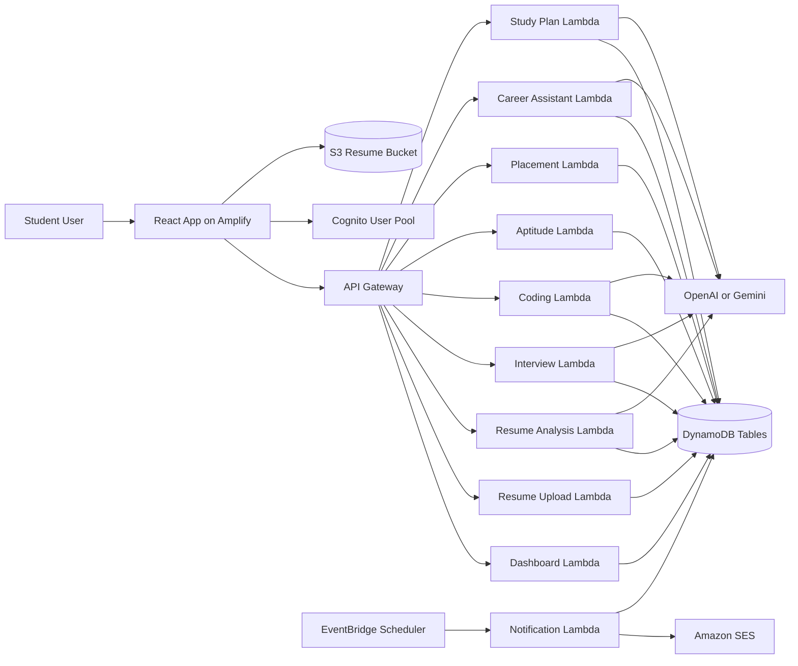

# Architecture

## System Overview

## Frontend Design

- `src/app` contains providers, router, and application shell bootstrapping.
- `src/features` groups modules by business capability.
- `src/components` contains reusable layout and UI building blocks.
- `src/lib` centralizes API access, query client setup, and helpers.

## Backend Design

- Each domain has a dedicated Lambda entrypoint with shared helpers in `src/shared`.
- Request validation happens in the Lambda layer using Zod schemas.
- DynamoDB tables are isolated by module for simpler scaling and IAM policies.
- S3 uploads use pre-signed URLs generated by Lambda instead of direct credential exposure.
- Cognito authorizers protect user-facing APIs.

## Security Notes

- JWTs are validated with API Gateway Cognito authorizers.
- Secrets stay in environment variables or AWS Secrets Manager references.
- IAM roles follow least privilege with resource-scoped access.
- User-owned records use `userId` partitioning patterns for multi-tenant safety.
